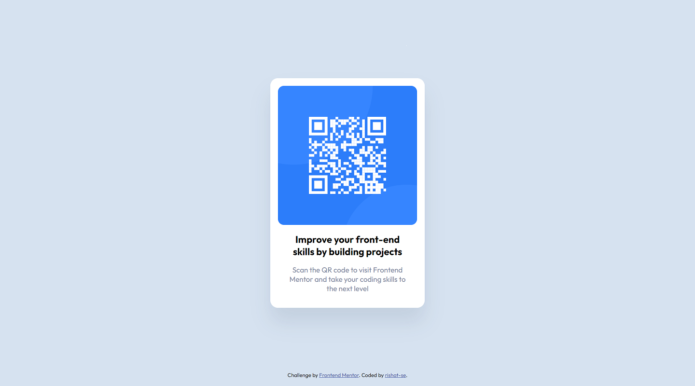

# Frontend Mentor - QR code component solution

This is a solution to the [QR code component challenge on Frontend Mentor](https://www.frontendmentor.io/challenges/qr-code-component-iux_sIO_H). Frontend Mentor challenges help you improve your coding skills by building realistic projects. 

## Table of contents

- [Overview](#overview)
  - [Screenshot](#screenshot)
  - [Links](#links)
- [My process](#my-process)
  - [Built with](#built-with)
  - [What I learned](#what-i-learned)
- [Author](#author)

## Overview

### Screenshot

### Links

- Solution URL: [https://github.com/rishat-se/qr-code-component](https://github.com/rishat-se/qr-code-component)
- Live Site URL: [https://adorable-dango-06f046.netlify.app](https://adorable-dango-06f046.netlify.app)

## My process

### Built with

- Semantic HTML5 markup
- CSS custom properties
- Flexbox

### What I learned

Learned how to sumbit solutions on Frontend Mentor and deploy site on Netlify.

## Author

- Frontend Mentor - [@rishat-se](https://www.frontendmentor.io/profile/rishat-se)
